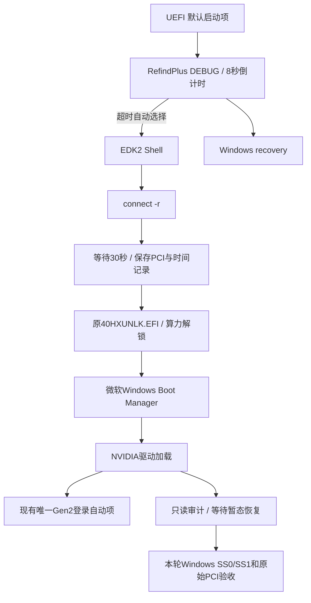

# 自动启动与双解锁稳定性方案

**2026-09-13 实机确认：RefindPlus 倒计时自动进入 Shell，完成原 EFI 算力解锁；进入 Windows 后 SS0=88888888、SS1=8，原始 PCIe 状态 Gen2 ×16，Code0。** 本目录是在上游解锁机制之上的启动调度、证据采集与恢复整改，适用于“手选能成功、自动启动不稳定”的调查与维护。它不是刷写 vBIOS，也没有修改显卡硬件。

上游：[PZH1gdmu/CMP40HX-Unlock](https://github.com/PZH1gdmu/CMP40HX-Unlock)。本 fork 保留上游源码及许可证；上游原 README 保存在 [UPSTREAM_README.md](../UPSTREAM_README.md)。本方案目前有成功实机样本，但连续冷启动/WOL和跨主板兼容性尚未完成验收。

## 完整流程

算力 EFI 必须每次启动重新执行；Gen2 的 Windows 操作不能替代它。操作显卡的 Gen2 自动入口只能保留一条，采集任务不做 PnP 或链路写入。RefindPlus 的8秒与Shell的30秒为本机成功组合，尚未做单变量实验，不能把成功全部归因于延时。

## 阅读顺序

1. [SETUP.md](SETUP.md)：BIOS前提、载荷准备、ESP布局、引导创建、自动启动和验收。
2. [FILES.md](FILES.md)：每个文件的用途、来源、固定版本与哈希。
3. [CASE-STUDY.md](CASE-STUDY.md)：失败/成功证据、问题与整改、仍未解释的细节。
4. [RECOVERY.md](RECOVERY.md)：无法启动、停用试验、恢复普通Windows。
5. [STREAMING.md](STREAMING.md)：Sunshine自启、40HX虚拟1080p144Hz与NVENC验证。
6. [UPSTREAM-TRACKING.md](UPSTREAM-TRACKING.md)：上游基线与每周更新规则。

## 本 fork 的实际整改

- 原生 EFI load option：保留分区设备路径，新建独立入口，不复制 Windows BCDOBJECT OptionalData，避免Windows重新生成旧映射。写入前备份，核对并发变化，写后回读。
- 独立 ESP 目录和 Windows 第二恢复项：不覆盖微软 loader/fallback，不在 Shell 返回后立即进入已经失败过的旧直启路径。
- 机器配置分离：公开脚本不带本机用户名、SID、ESP GUID 或启动项 GUID；`Prepare-LocalProfile.ps1` 在本地读取并生成配置，生成结果不提交。
- 新证据采集器只读：等待驱动短暂重载恢复，区分初始瞬态与最终状态，不因SMI显示Gen1而触发重训；对EFI日志与Windows诊断进行本次启动关联，使用最后一条final结果。
- 不把旧成功日志当成GSP覆盖，也不把日志缺失直接说成EFI已卸载。EFI成功、Windows算力、PCIe原始状态和驱动健康分别记录。
- 固定版本依赖准备脚本只下载/提取/校验，不执行安装器，不关闭安全功能，不重启机器。

上游GUI/安装器的旧诊断提示和Gen2内部重试代码仍保留，未重新编译成一个新“修复版exe”。新工具覆盖了本方案的证据判定与引导管理；不要把上游exe版本号看作这些整改已内置。

## 当前验证边界

已验证本机：ASUS CMP40HX，JGINYUE H311M-HD3 / AMI5.12，RainCandy616.56，Windows11，GSP设备级1。2026-09-13 12:10自动链执行成功，12:18 Windows诊断确认双解锁；同日Sunshine识别40HX的1080p144Hz虚拟输出并成功创建H.264/HEVC NVENC编码器。

公开参数化脚本的22项保护/证据测试、只读本机配置导出、真实证据采集及载荷提取通过。原固定本机部署版本已实机成功；公开参数化版本没有在成功机器上重新执行Apply，避免无意义重写引导。连续3次重启、3次完整冷启动、2次WOL和长期负载，以及客户端144 FPS实际串流仍需验收。

当前电脑已经完成部署，不要为了使用这个fork再运行上游整套安装器或重复Apply。维护时先采集状态、核对本轮日志，再决定是否需要最小修改。
